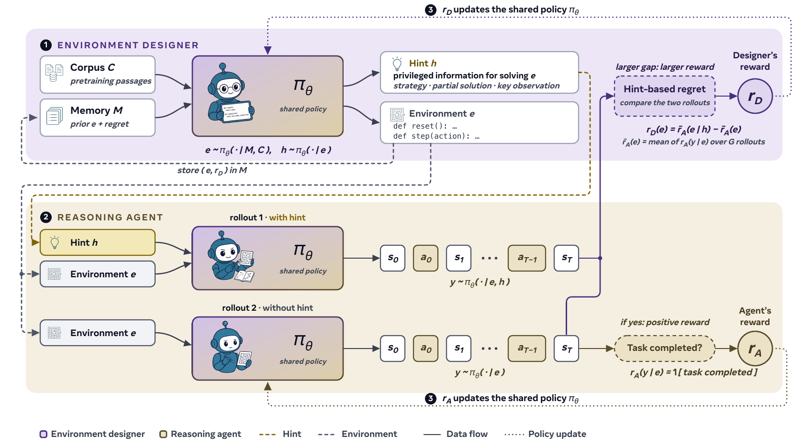

<h1 align="center">SPADE &#9824;</h1>

<h2 align="center"> Self-Play in Adaptive Synthetic Executable Environments </h2>

<div align="center" style="line-height: 1;">
  <a href="https://github.com/spade-rl/spade" target="_blank"></a>
  <a href="https://huggingface.co/datasets/spare-rl/spare-gpt55-static-corpus" target="_blank"></a>
  <a href="LICENSE" target="_blank"></a>
</div>

<p align="center">
  <a href="https://huggingface.co/datasets/spare-rl/spare-gpt55-static-corpus"><b>&#129303; Static Environment Corpus</b></a>
</p>

## Updates

* 11/08/2026: &#127881; We release our self-play codebase and the static GPT-5.5 environment corpus.

## Introduction

Recent advances in reinforcement learning have shown that language models can develop sophisticated reasoning through training on tasks with verifiable rewards, but these approaches draw their reward signal from fixed, hand-built pools of environments that stop adapting once the learner masters them.

We introduce SPADE, a self-play framework where a single language model learns in two roles: an **environment designer that writes complete multi-turn environments as executable Python with `reset()` and `step()` interfaces, and a reasoning agent that learns by acting in them**. The designer is trained with **hint-based regret**, the gap between the agent's return with and without a privileged hint, which steers generation toward environments at the agent's capability frontier while keeping them feasible. Through this loop, SPADE generates an **_adaptive curriculum_** that keeps moving with the learner instead of saturating.

Applying SPADE to Qwen3 models at 4B, 8B, and 30B-A3B scale in two settings, cognitive games and multi-turn tool use, we observe the designer produce progressively harder, more interactive environments and the agent improve on held-out math, science, code, and procedural-reasoning benchmarks past the saturation point of fixed-environment baselines. These results suggest that making environment design itself a learnable component is a promising direction for open-ended self-improvement.

## Architecture

<p align="center"></p>

SPADE trains one shared policy that plays both roles. Each cycle, the environment designer samples grounding context from a pretraining corpus and an environment memory, then writes a complete executable environment with a privileged hint; generated code passes structural and runtime validation before entering the training pool. The reasoning agent plays each environment with and without the hint: task return trains the agent role, hint-based regret trains the designer role, and per-role advantage normalization keeps the joint update stable. The backend-independent orchestration lives in `spare/core/`; distributed training uses the Slime/SGLang integration under `spare/slime/` (SGLang inference, Megatron-LM policy updates, Ray orchestration), with a retained Tinker integration under `spare/tinker/`.

## Usage

### Installation
```bash
# clone codebase with pinned submodules (slime, tinker-cookbook)
git clone --recurse-submodules git@github.com:spade-rl/spade.git && cd spade

# prepare environment
python -m venv .venv && source .venv/bin/activate

# install dependencies
python -m pip install --upgrade pip
python -m pip install -e .
```

Python 3.10 through 3.12 are supported; `python -m pip install -e ".[dev]"` adds test and lint tooling. GEM support on Python 3.12.1+ needs `python -m pip install --ignore-requires-python gem-llm`; see [`cmd/README.md`](cmd/README.md) for details.

### Training

The launchers read paths and credentials from the environment:

```bash
export MODEL_ROOT=/path/to/model/checkpoints     # HF checkpoints + Megatron conversions
export WORKSPACE_DIR=/path/to/spade/workspace    # external eval data (aime-*/, bfcl/)
export CORPUS_FILE=/path/to/grounding.jsonl      # designer grounding corpus (adaptive recipes)
export WANDB_API_KEY=...                         # Weights & Biases logging
export WANDB_ENTITY=your-wandb-entity
```

```bash
bash cmd/games/train_spade_30b.sh
```

This training script runs SPADE games self-play for 400 rollouts on a single 8-GPU node, training both roles of Qwen3-30B-A3B-Instruct with GRPO. The full paper matrix is organized by setting:

| Setting | Models | Commands |
|---|---|---|
| SPADE games | 4B, 8B, 30B-A3B | `cmd/games/train_spade_{4b,8b,30b}.sh` |
| Fixed-env GRPO, GPT-5.5 corpus | 4B, 8B, 30B-A3B | `cmd/games/train_fixed_gpt55_{4b,8b,30b}.sh` |
| Fixed-env RLVE | 4B, 8B, 30B-A3B | `cmd/games/train_fixed_rlve_{4b,8b,30b}.sh` |
| SPADE tool use | 4B, 8B, 30B-A3B | `cmd/tool_use/train_spade_{4b,8b,30b}.sh` |
| Paper ablations | 30B-A3B | `cmd/ablations/*.sh` |

The fixed-env GRPO recipes need no `CORPUS_FILE`: they train on the released [static GPT-5.5 corpus](https://huggingface.co/datasets/spare-rl/spare-gpt55-static-corpus) (7,872 validated Python environments across six cognitive skills, pinned revision with per-environment SHA-256 checksums, Apache-2.0). Checkpoint and data prerequisites are documented in [`cmd/README.md`](cmd/README.md#prerequisites), and the setting-specific READMEs under `cmd/games/`, `cmd/tool_use/`, and `cmd/ablations/` document the corpora and overrides each recipe expects.

### Evaluation

`eval_offline/` scores a trained checkpoint, or an OpenAI-compatible endpoint, against the benchmark suites retained for the paper:

```bash
# run the offline benchmark suites
python -m eval_offline.run_offline_eval --help

# format the results
python -m eval_offline.render_table --help
```

The runner needs the `[eval]` extra and per-benchmark data setup; both, plus the retained benchmark matrix, are documented in [`eval_offline/README.md`](eval_offline/README.md). `eval_configs/` is separate: those YAML files drive the in-loop evaluations the training launchers run during a job.

## Tinker Training

SPADE also supports training with [Thinking Machines](https://thinkingmachines.ai/tinker)' **Tinker** distributed training framework through the retained integration under `spare/tinker/`.

### Quick Start

```bash
# Install with Tinker dependencies (Python 3.11+)
python -m pip install -e ".[tinker]"
```

### Supported Models

| Model | Launchers |
|-------|-----------|
| Qwen3-4B-Instruct | `cmd/tinker/qwen3_4b_instruct/` |
| Qwen3-8B | `cmd/tinker/qwen3_8b/` |
| Qwen3-8B-Base | `cmd/tinker/qwen3_8b_base/` |
| Qwen3-30B-A3B-Instruct | `cmd/tinker/qwen3_30b_instruct/` |
| GPT-OSS-20B | `cmd/tinker/gpt_oss_20b/` |

See [`cmd/tinker/README.md`](cmd/tinker/README.md) for setup, launchers, and advanced usage. For more information on the Tinker framework, see the [tinker-cookbook](https://github.com/thinking-machines-lab/tinker-cookbook) repository.

## Citation

If you find our work useful for your research, please consider citing:
```bibtex
@misc{liu2026spade,
  title  = {SPADE: Self-Play in Adaptive Synthetic Executable Environments},
  author = {Bo Liu and Simon Yu and Yiding Jiang and Ao Qu and Andrew Zhao and
            Zichen Liu and Junsu Kim and Zijian Zhou and Seungone Kim and
            Tongzheng Ren and Mickel Liu and Hanfei Yu and Zhaorun Chen and
            Weiyan Shi and Paul Pu Liang and Luke Zettlemoyer and Yejin Choi and
            Natasha Jaques},
  year   = {2026}
}
```

## Acknowledgement
* The distributed RL training is implemented with [Slime](https://github.com/THUDM/slime), pairing [SGLang](https://github.com/sgl-project/sglang) inference with Megatron-LM policy updates, and informed by the [Miles](https://github.com/radixark/miles) team's RL post-training framework.
* We thank [Thinking Machines](https://thinkingmachines.ai/tinker) for the Tinker framework and [tinker-cookbook](https://github.com/thinking-machines-lab/tinker-cookbook), the retained alternative training backend.
* We thank [Modal](https://modal.com) for compute and model serving during development.
* The evaluation stack builds on RLVE, the Berkeley Function Calling Leaderboard, and PRIME evaluation utilities.
* The base models are from [Qwen3](https://huggingface.co/Qwen/Qwen3-30B-A3B-Instruct-2507).

SPADE source code is released under the [MIT License](LICENSE); datasets, vendored code, and adapted evaluation components retain their respective licenses as documented in [`THIRD_PARTY_NOTICES.md`](THIRD_PARTY_NOTICES.md).
